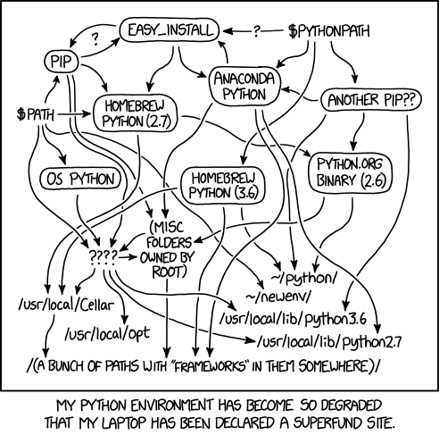

# Project 0

## Introduction
The goal of this project 0 is to help you set up your python environment and to give you an introduction to the mechanics of the online grading system.

As a reminder, this course assumes a basic understanding of Python at the level of 6.00.1x Introduction to Computer Science and Programming using Python (also on MIT Open CourseWare). This means you should be proficient in the following: functions, tuples and lists, mutability, recursion, dictionaries, and object-oriented programming.

Additionally, we expect you to be able to install the required packages using pip and be comfortable reading the documentation of these packages to find out more about the functions you are not familiar with.


## Instruction
Required python packages

Throughout this course, we will be using Python 3.8 along with the following packages. Code written in new versions of python will be accepted, as long as functions/features that are available only in Python 3.9 or beyond are not used.

- NumPy
- matplotlib
- scikit-learn
- SciPy
- tqdm
- PyTorch

Installation using pip

If you already have a working installation of Python 3, you should be able to install all of the above packages using pip.

```shell
pip3 install numpy
pip3 install matplotlib
pip3 install scipy
pip3 install tqdm
pip3 install scikit-learn
```


For PyTorch, follow the instructions on https://pytorch.org/to install from pip repository corresponding to your system. You will not need CUDA for this course.

In the above commands, you can replace pip3 with python3 -m pip to make sure you are installing the packages for the version of python your system is currently using.

Installation using conda

However, the recommended way of configuring your system is by using a conda environment.

We recommend that you install the latest version of Miniconda from https://docs.conda.io/en/latest/miniconda.html.

You can then create a conda environment for this course using
```
conda create -n 6.86x python=3.8
```
Note: As mentioned above, you may use other versions of python, as long as functions available only in 3.9+ are not used.

To activate this environment, use
```
conda activate 6.86x
```
Finally, install all of the required packages:

```shell
conda install pytorch -c pytorch
conda install numpy
conda install matplotlib
conda install scipy
conda install tqdm
conda install scikit-learn
```

### Testing your installation

Download project0.tar.gz and untar it in to a working directory. To deal with tar.gz files on windows, you can use 7-zip.

The project0 folder contains two pyhon files.

main.py contains the various functions you will to complete in the next sections of the project

test.py is a script which runs tests

debug.py contains the code for the final problem of this project

Tip: Throughout the whole online grading system, you can assume the NumPy python library is already imported as np.

This project will unfold both on MITx and on your local machine. You are welcome to implement functions locally and then copy+paste your code into the MITx code boxes to fully check correctness and receive your grade for individual function implementations. Alternatively, you can also implement the functions online first and after finishing, copy+paste the solution to your local main.py file. Be wary of the number of attempts you have for each problem, especially if you choose the second development flow.

**How to Test Locally**: 
In your terminal, navigate to the directory where your project files reside. Execute the command **python test.py** to run all the available tests.

For this project, the test.py file will test that all required packages are correctly installed.

Tip: We recommend using a proper IDE for this course such as Visual Studio Code, Pycharm, etc.


### Introduction to ML packages

In the resources tab of the course, we have provided you with two notebooks.

Introduction to ML packages (part 1) Github - Notebook viewer
Introduction to ML packages (part 2) Github - Notebook viewer

They cover some of the most useful ML packages and constitute a good reference point to refer to as you progress through the course.

We do not expect you to complete all sections in these notebooks immediately. For now, go through the first three sections in the first notebook on Jupyter, Numpy, and Matplotlib. Then after Unit 1 Linear Classifiers, come back to the section on Scikit learn, and while you work on Unit 3 Neural Nets, refer to the second notebook, which gives an introduction to Pytorch.

We will not be using Pandas in this course, but it is a useful tool. Feel free to look at the section on Pandas at any time.

By the end of the course, our hope is that you are able to recreate the content of these notebooks by yourself …and more!


在机器学习中，有很多原因会导致模型表现不佳。模型可能设计得很差，数据可能噪声太大，可能只是初始化不好，或者超参数的选择不好，等等。因此，使用调试器至少排除工程错误是至关重要的。

幸运的是，Python附带了一个名为pdb的全功能交互式调试器。

下面是pdb的使用教程：

## pdb - Python调试器
### 检查变量值
在要中断调试器的位置插入以下代码：
```python
import pdb; pdb.set_trace()
```
当执行到这一行后，Python 会停止并进入一个交互界面等待您告诉它下一步要做什么。您会看到一个(Pdb)提示。这意味着您现在已在交互式调试器中暂停并可以输入命令。

从 Python 3.7 开始支持直接调用内置函数breakpoint()，它不再需要提前import pdb库，效果和pdb.set_trace()相同，而且更加灵活，当需要禁止调试时可以设置PYTHONBREAKPOINT=0（需要在命令行中设置）。

如果想直接在命令行中进行调试，可输入-m pdb，例如：
```shell
$ python3 -m pdb app.py arg1 arg2
```

